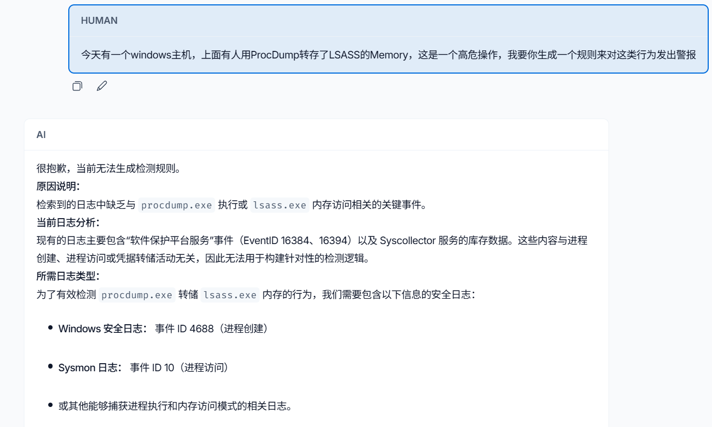
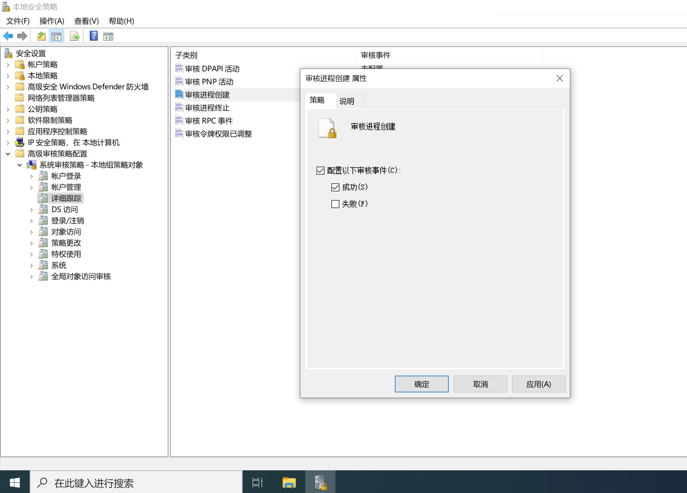
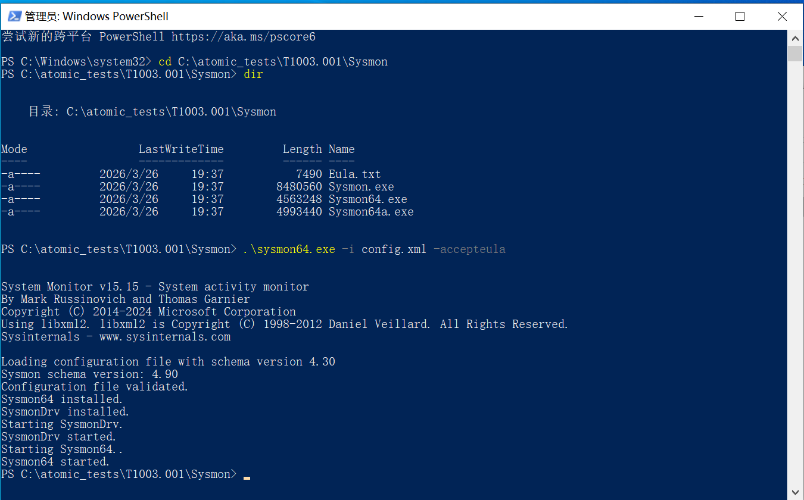
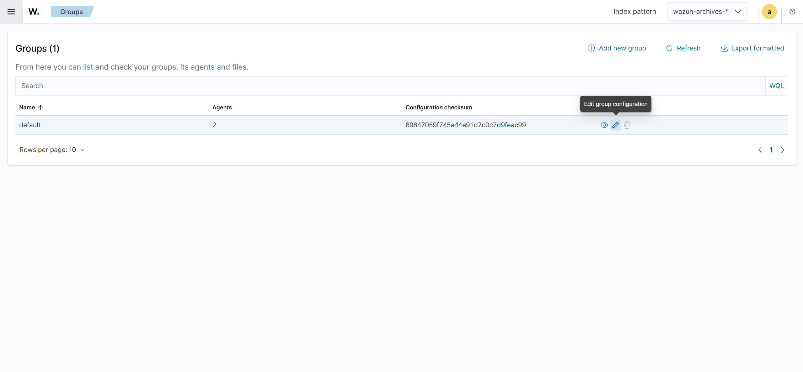

根据[T1003.001](https://github.com/redcanaryco/atomic-red-team/blob/master/atomics/T1003.001/T1003.001.md)的场景来测试rule_generator的能力。

## 步骤

首先，在wazuh所监控的windows主机上运行[脚本](https://github.com/redcanaryco/atomic-red-team/blob/master/atomics/T1003.001/T1003.001.md#atomic-test-1-dump-lsassexe-memory-using-procdump)。目的是为了触发一个转储事件。

### 触发ProcDump转储

1. 获取ProcDump
在实验目录下，将以下脚本存为`Install-ProcDump.ps1`
```powershell
$procdump_exe = "$PSScriptRoot\procdump.exe"
$zip_path = "$PSScriptRoot\Procdump.zip"
$extract_dir = "$PSScriptRoot\ProcdumpTemp"

# 启用TLS
[Net.ServicePointManager]::SecurityProtocol = [Net.SecurityProtocolType]::Tls12

Write-Host "=== 当前目录安装 ProcDump ===" -ForegroundColor Cyan

# 下载
Invoke-WebRequest "https://download.sysinternals.com/files/Procdump.zip" -OutFile $zip_path

# 解压
Expand-Archive $zip_path $extract_dir -Force

# 复制到当前目录
Copy-Item "$extract_dir\procdump.exe" $procdump_exe -Force

# 验证
if (Test-Path $procdump_exe) {
    Write-Host "✅ 安装成功！当前目录已生成 procdump.exe" -ForegroundColor Green
} else {
    Write-Host "❌ 安装失败" -ForegroundColor Red
}
```
之后用powershell来运行上述脚本，可能需要事先执行：
```powershell
Set-ExecutionPolicy RemoteSigned -Force
```

2. 导出LSASS内存
保存为`Dump_LSASS.bat`
```bat
@echo off
REM 全部在当前目录运行，无上级目录
set procdump=procdump.exe
set dumpfile=lsass_dump.dmp

echo 正在导出 lsass.exe 内存...
"%procdump%" -accepteula -ma lsass.exe "%dumpfile%"

echo.
if exist "%dumpfile%" (
    echo ✅ 成功！文件：%dumpfile%
) else (
    echo ❌ 失败！请用管理员运行
)
pause
```

3. 观察运行结果



4. 原因分析，需要添加相关的日志到wazuh agent的监控当中

### 添加日志到wazuh的配置文件

1. 启动windows进程创建审计（Event ID 4688）
首先按Win+R，然后输入`secpol.msc`打开本地安全策略。按照下图设置。



2. 安装并配置Sysmon（Event ID 10）

通过[微软的官方地址](https://learn.microsoft.com/en-us/sysinternals/downloads/sysmon)来下载Sysmon.

创建Sysmon配置文件`config.xml`：
```xml
<Sysmon schemaversion="4.30">
  <EventFiltering>
    <ProcessAccess onmatch="include">
      <TargetImage condition="end with">lsass.exe</TargetImage>
    </ProcessAccess>
    <ProcessCreate onmatch="include">
      <Image condition="contains">procdump.exe</Image>
    </ProcessCreate>
  </EventFiltering>
</Sysmon>
```

最后安装sysmon:
```powershell
.\sysmon64.exe -i config.xml -accepteula
```



3. 通过Wazuh Dashboard来配置日志收集

通过左侧的Agent Mangement -> Groups来进行组策略的配置。



配置如下：
```xml
<agent_config>
  <!-- 收集 Windows 安全日志，包含进程创建 (Event ID 4688) -->
  <localfile>
    <location>Security</location>
    <log_format>eventchannel</log_format>
  </localfile>

  <!-- 收集 Sysmon 日志，包含进程访问 (Event ID 10) -->
  <localfile>
    <location>Microsoft-Windows-Sysmon/Operational</location>
    <log_format>eventchannel</log_format>
  </localfile>
</agent_config>
```

4. 重启主机或者wazuh agent。